# Image Correction
## 1.Tasks for image correction

### 1.1 Histogram computation
#### HM
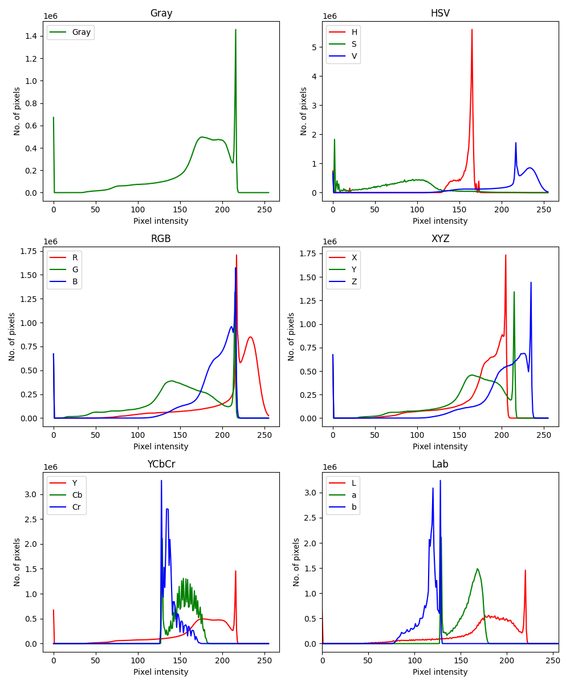


#### P63
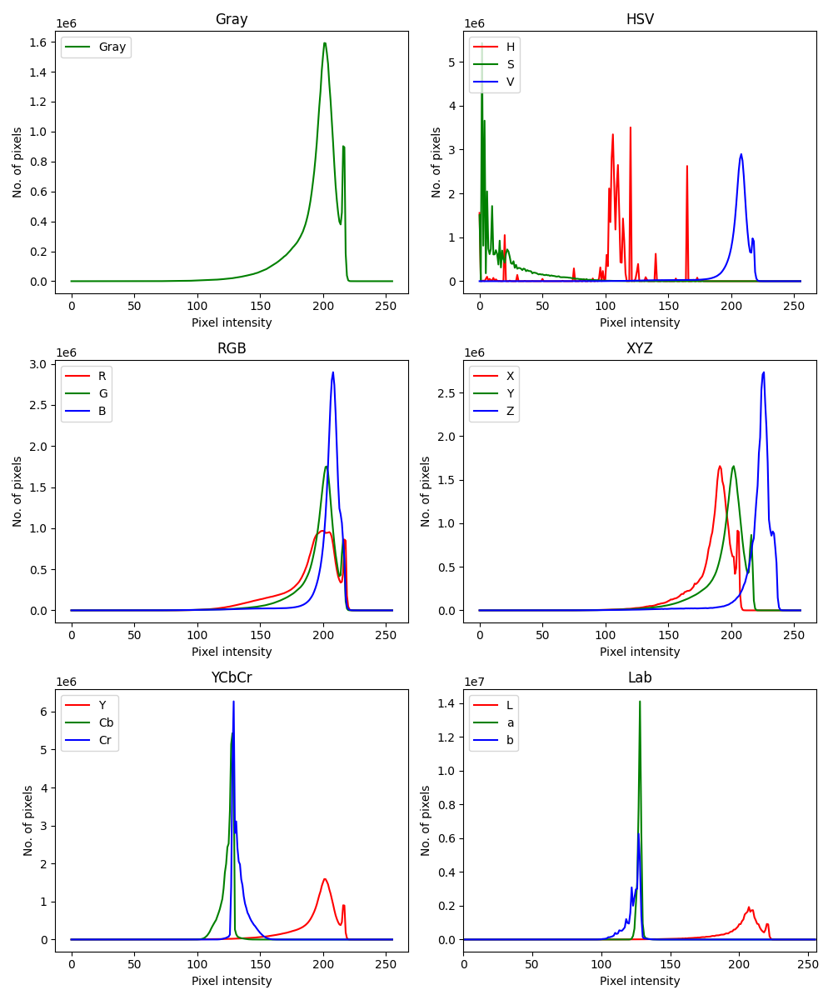


### 1.2 Histogram equalization
#### Gray
Just take the only one channel and apply the redistribution of intensities.
```python
# RGB[A] to Gray: Y ← 0.299⋅R + 0.587⋅G + 0.114⋅B
gray = cv.cvtColor(img, cv.COLOR_BGR2GRAY)
# Basic
equalizated = cv.equalizeHist(gray)
```
The gray result:

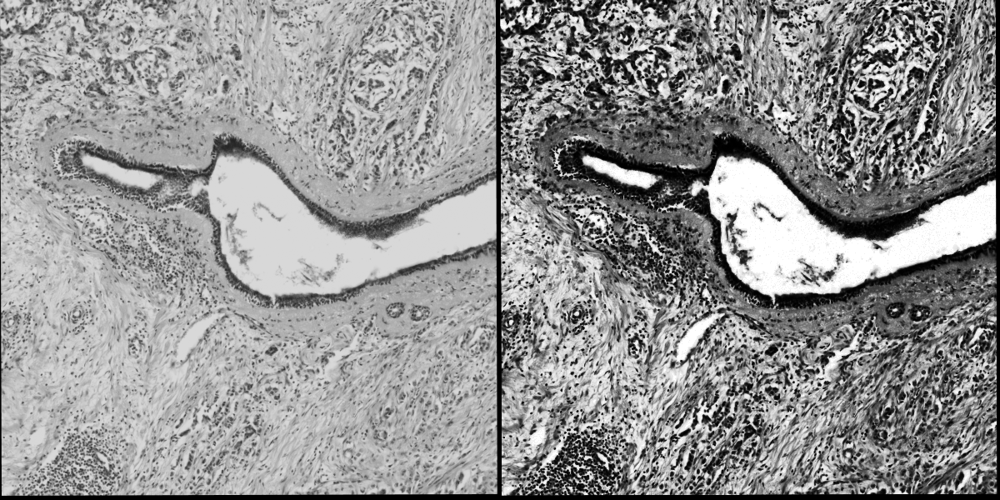

#### RGB
We can take each channel and apply the redistribution of intensities.
```python
rgb = cv.cvtColor(img, cv.COLOR_BGR2RGB)
# Basic
R, G, B = cv.split(rgb)
eqR = cv.equalizeHist(R)
eqG = cv.equalizeHist(G)
eqB = cv.equalizeHist(B)
eqRGB = cv.merge((eqR, eqG, eqB))
```
The rgb result:

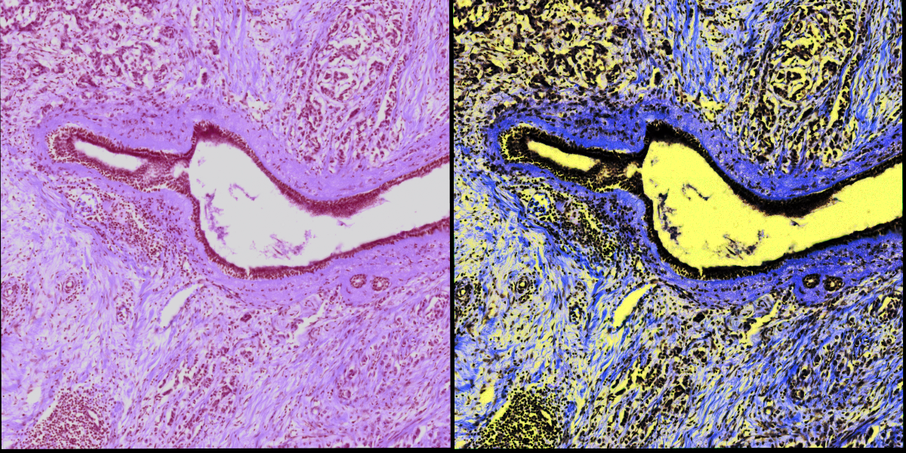

#### YCbCr
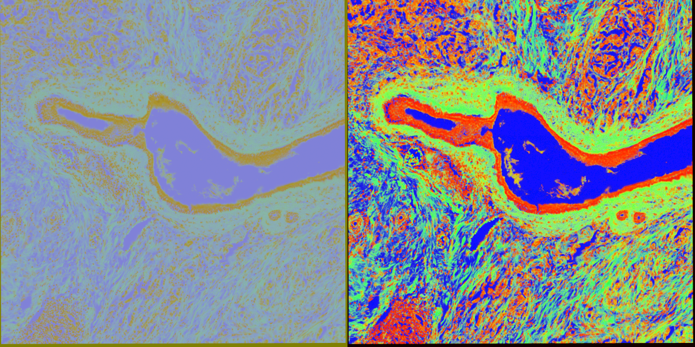

#### HSV
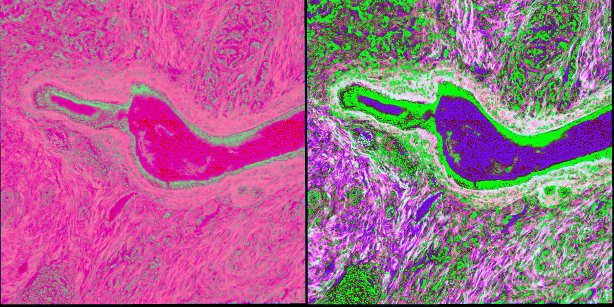

#### XYZ
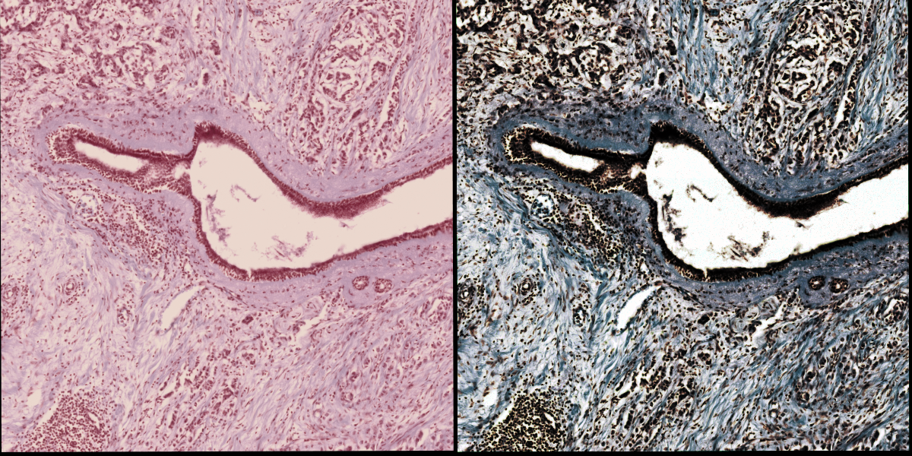

#### Lab
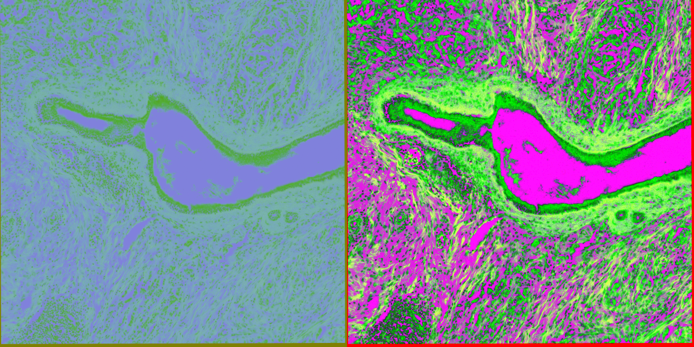

### 1.3 Gamma correction
```python
def gammaCorrection(src, gamma):
    invGamma = 1 / gamma
    table = [((i / 255) ** invGamma) * 255 for i in range(256)]
    table = np.array(table, np.uint8)
    return cv.LUT(src, table)

img = cv.imread('images\HMRegistred.png')
img = resize(img, 10)
gammaImg = gammaCorrection(img, 0.4)
```
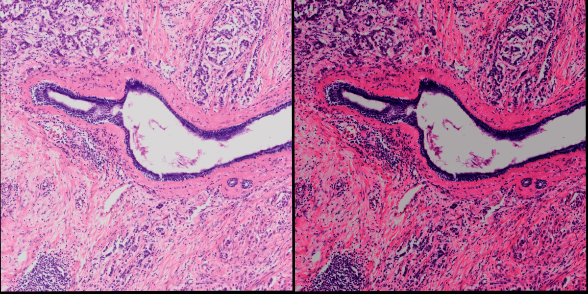


## 2.Tasks of image enhancement
### 2.1 Segmentation utilizing the color information (Lab color model)
Chequin the correct convertion:
```python
rgb = cv.cvtColor(blue, cv.COLOR_BGR2RGB)
color = ('y','c','r')
Lab = cv.cvtColor(blue, cv.COLOR_BGR2Lab)
# print(rgb[0][0])
# print(Lab[0][0])
pLab = Lab[0][0]
pRGB = rgb[0][0]

# Get XYZ format of one pixel:
X = round(0.412453*pRGB[0]+0.357580*pRGB[1]+0.180423*pRGB[2])
Y = round(0.212671*pRGB[0]+0.715160*pRGB[1]+0.072169*pRGB[2])
Z = round(0.019334*pRGB[0]+0.119193*pRGB[1]+0.950227*pRGB[2])
XYZ = cv.cvtColor(img, cv.COLOR_BGR2XYZ)
print(XYZ[0][0] == [X, Y, Z])

# Get Lab format of one pixel:
X = X/0.950456
Z = Z/1.088754

L = 116*(Y**(1/3)) - 16

def f(t):
    if (t>0.008856):
        return t**(1/3)
    else:
        return 7.787*t+16/116

delta = 128

a = 500*(f(X) - f(Y)) + delta
b = 200*(f(Y) - f(Z)) + delta
print(L,a,b)
```
Select the small part of the image containing only nuclei and compute its Lab color model (target) - average L / a / b values

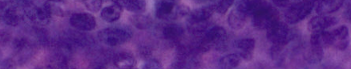

```python
Lab = cv.cvtColor(blue, cv.COLOR_BGR2Lab)
L,a,b = cv.split(Lab)
avgL = np.mean(L)
avga = np.mean(a)
avgb = np.mean(b)
```
Compute delta Lab:
```python
def diff(pix):
    return np.sqrt((pix[0]-avgL)**2+(pix[1]-avga)**2+(pix[2]-avgb)**2)

Labimg = cv.cvtColor(img, cv.COLOR_BGR2Lab)
diff_image = np.zeros((Labimg.shape[0],Labimg.shape[1],1), np.float32)
for y in range(Labimg.shape[1]):
    for x in range(Labimg.shape[0]):
        diff_image[x][y] = diff(Labimg[x][y])
```


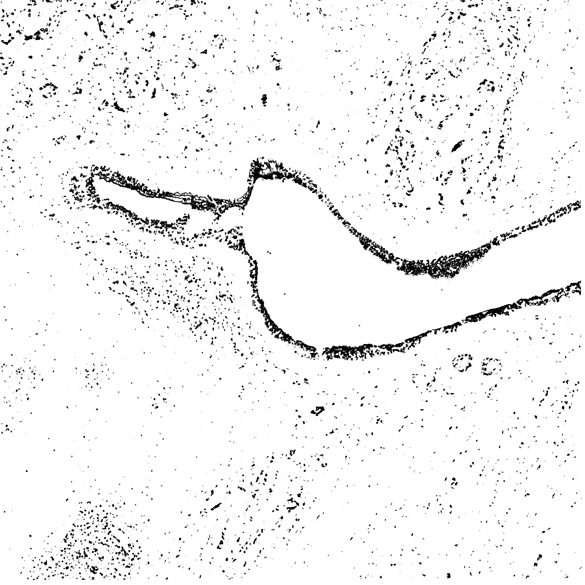

### 2.2 Feature detectors
#### 2.2.1 Harris
```python
gray = cv.cvtColor(img,cv.COLOR_BGR2GRAY)
gray = np.float32(gray)
dst = cv.cornerHarris(gray,2,3,0.14)
# Threshold for an optimal value, it may vary depending on the image.
img[dst>0.01*dst.max()]=[0,255,0]
```
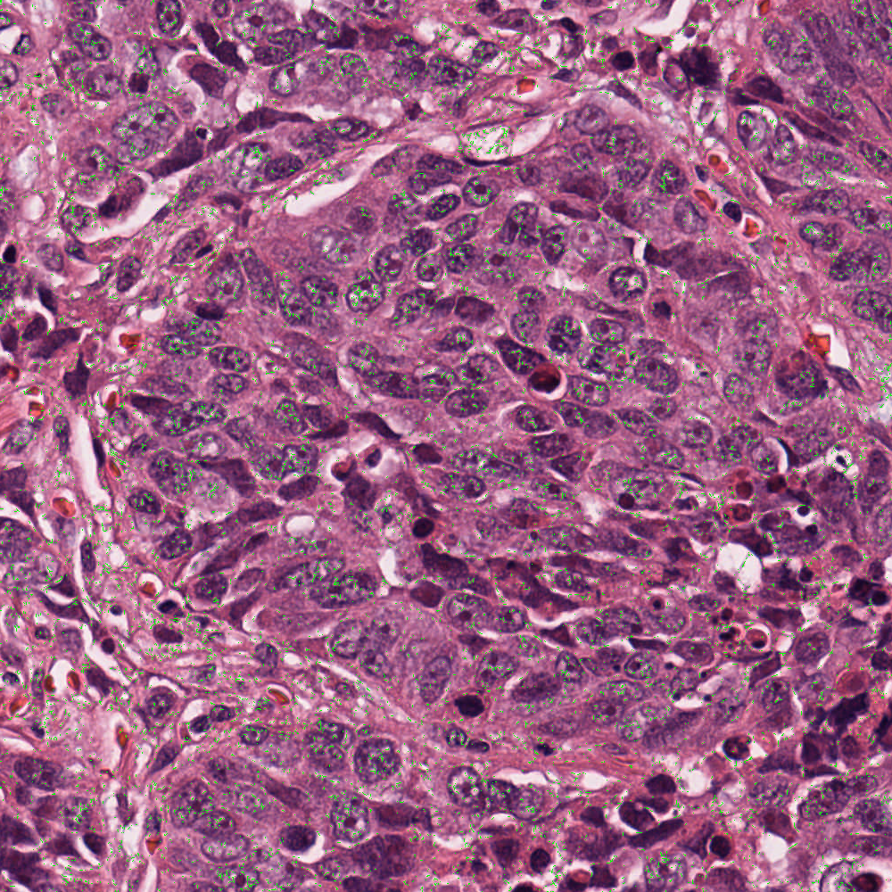
#### 2.2.2 FAST
```python
# Initiate FAST object with default values
fast = cv.FastFeatureDetector_create(threshold=35)
# find and draw the keypoints
kp = fast.detect(gray,None)
img2 = cv.drawKeypoints(gray, kp, None, color=(255,0,0))
# Disable nonmaxSuppression
fast.setNonmaxSuppression(0)
kp = fast.detect(img, None)
img3 = cv.drawKeypoints(img, kp, None, color=(255,0,0))
```


#### 2.2.3 SIFT
```python
sift = cv.SIFT_create()
kp = sift.detect(gray, None)
img = cv.drawKeypoints(gray, kp, img)
```
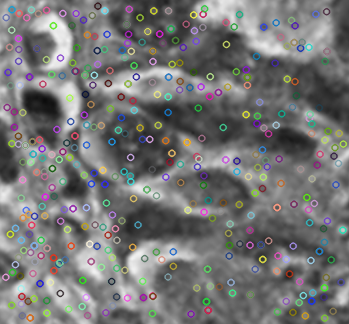
### 2.3 Feature descriptors
#### 2.2.1 SIFT
```python
################################################### SIFT
img1 = cv.imread(os.path.join(path_in, name_in1))
img1.astype('float32')

img2 = cv.imread(os.path.join(path_in, name_in2))
img2.astype('float32')
#sift
sift = cv.xfeatures2d.SIFT_create()

keypoints_1, descriptors_1 = sift.detectAndCompute(img1,None)
keypoints_2, descriptors_2 = sift.detectAndCompute(img2,None)

#feature matching
bf = cv.BFMatcher(cv.NORM_L1, crossCheck=True)

matches = bf.match(descriptors_1, descriptors_2)
matches = sorted(matches, key = lambda x:x.distance)

img3 = cv.drawMatches(img1, keypoints_1, img2, keypoints_2, matches[:50], img2, flags=2)
cv.imwrite(os.path.join(path_out, 'sift'+name_out), img3)
```

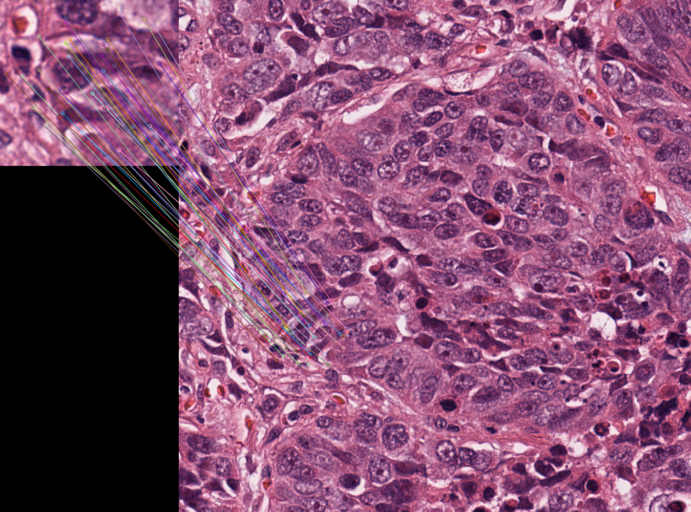
#### 2.2.2 SURF
This algorithm is patented and the use of the library is not free


#### 2.2.3 ORB
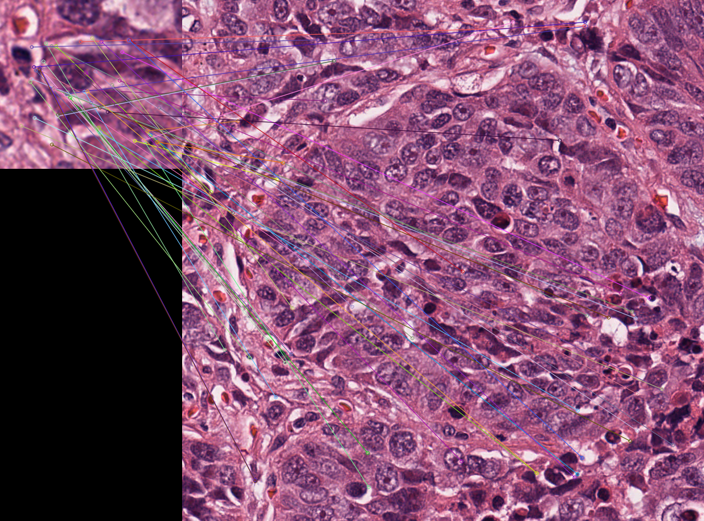


### 2.4 Homography matrix
```python
img_object = cv.imread(os.path.join(path_in, name_in1), cv.IMREAD_GRAYSCALE)
img_scene = cv.imread(os.path.join(path_in, name_in2), cv.IMREAD_GRAYSCALE)
img_object.astype('float32')
img_scene.astype('float32')

#-- Step 1: Detect the keypoints using SURF Detector, compute the descriptors
minHessian = 400
detector = cv.xfeatures2d.SIFT_create()
keypoints_obj, descriptors_obj = detector.detectAndCompute(img_object, None)
keypoints_scene, descriptors_scene = detector.detectAndCompute(img_scene, None)
#-- Step 2: Matching descriptor vectors with a FLANN based matcher
# Since SURF is a floating-point descriptor NORM_L2 is used
matcher = cv.DescriptorMatcher_create(cv.DescriptorMatcher_FLANNBASED)
knn_matches = matcher.knnMatch(descriptors_obj, descriptors_scene, 2)
#-- Filter matches using the Lowe's ratio test
ratio_thresh = 0.75
good_matches = []
for m,n in knn_matches:
    if m.distance < ratio_thresh * n.distance:
        good_matches.append(m)
#-- Draw matches
img_matches = np.empty((max(img_object.shape[0], img_scene.shape[0]), img_object.shape[1]+img_scene.shape[1], 3), dtype=np.uint8)
cv.drawMatches(img_object, keypoints_obj, img_scene, keypoints_scene, good_matches, img_matches, flags=cv.DrawMatchesFlags_NOT_DRAW_SINGLE_POINTS)
#-- Localize the object
obj = np.empty((len(good_matches),2), dtype=np.float32)
scene = np.empty((len(good_matches),2), dtype=np.float32)
for i in range(len(good_matches)):
    #-- Get the keypoints from the good matches
    obj[i,0] = keypoints_obj[good_matches[i].queryIdx].pt[0]
    obj[i,1] = keypoints_obj[good_matches[i].queryIdx].pt[1]
    scene[i,0] = keypoints_scene[good_matches[i].trainIdx].pt[0]
    scene[i,1] = keypoints_scene[good_matches[i].trainIdx].pt[1]
H, _ =  cv.findHomography(obj, scene, cv.RANSAC)
#-- Get the corners from the image_1 ( the object to be "detected" )
obj_corners = np.empty((4,1,2), dtype=np.float32)
obj_corners[0,0,0] = 0
obj_corners[0,0,1] = 0
obj_corners[1,0,0] = img_object.shape[1]
obj_corners[1,0,1] = 0
obj_corners[2,0,0] = img_object.shape[1]
obj_corners[2,0,1] = img_object.shape[0]
obj_corners[3,0,0] = 0
obj_corners[3,0,1] = img_object.shape[0]
scene_corners = cv.perspectiveTransform(obj_corners, H)
#-- Draw lines between the corners (the mapped object in the scene - image_2 )
cv.line(img_matches, (int(scene_corners[0,0,0] + img_object.shape[1]), int(scene_corners[0,0,1])),\
    (int(scene_corners[1,0,0] + img_object.shape[1]), int(scene_corners[1,0,1])), (0,255,0), 4)
cv.line(img_matches, (int(scene_corners[1,0,0] + img_object.shape[1]), int(scene_corners[1,0,1])),\
    (int(scene_corners[2,0,0] + img_object.shape[1]), int(scene_corners[2,0,1])), (0,255,0), 4)
cv.line(img_matches, (int(scene_corners[2,0,0] + img_object.shape[1]), int(scene_corners[2,0,1])),\
    (int(scene_corners[3,0,0] + img_object.shape[1]), int(scene_corners[3,0,1])), (0,255,0), 4)
cv.line(img_matches, (int(scene_corners[3,0,0] + img_object.shape[1]), int(scene_corners[3,0,1])),\
    (int(scene_corners[0,0,0] + img_object.shape[1]), int(scene_corners[0,0,1])), (0,255,0), 4)
#-- Show detected matches
```
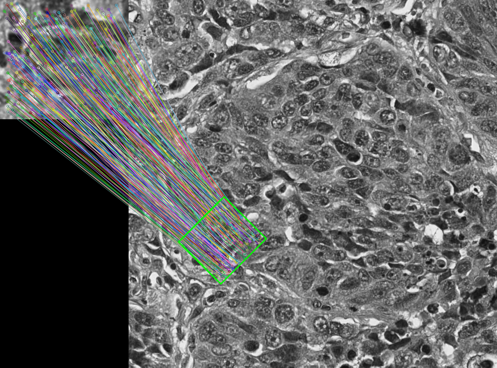
## References
* Calculating histogram: https://docs.opencv.org/4.x/d1/db7/tutorial_py_histogram_begins.html
* Gamma correction: https://lindevs.com/apply-gamma-correction-to-an-image-using-opencv
* Harris: https://docs.opencv.org/4.x/dc/d0d/tutorial_py_features_harris.html
* FAST: https://docs.opencv.org/3.4/df/d0c/tutorial_py_fast.html
* FIST: https://www.analyticsvidhya.com/blog/2019/10/detailed-guide-powerful-sift-technique-image-matching-python/
* ORB: https://pysource.com/2018/03/21/feature-detection-sift-surf-obr-opencv-3-4-with-python-3-tutorial-25/
* Homography: https://docs.opencv.org/3.4/d7/dff/tutorial_feature_homography.html