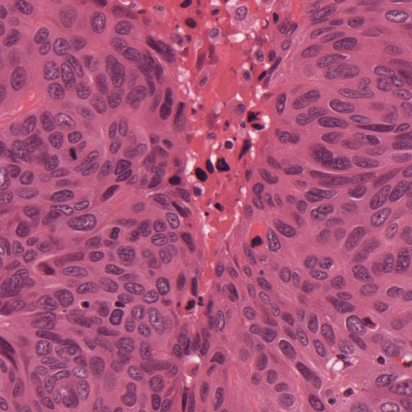
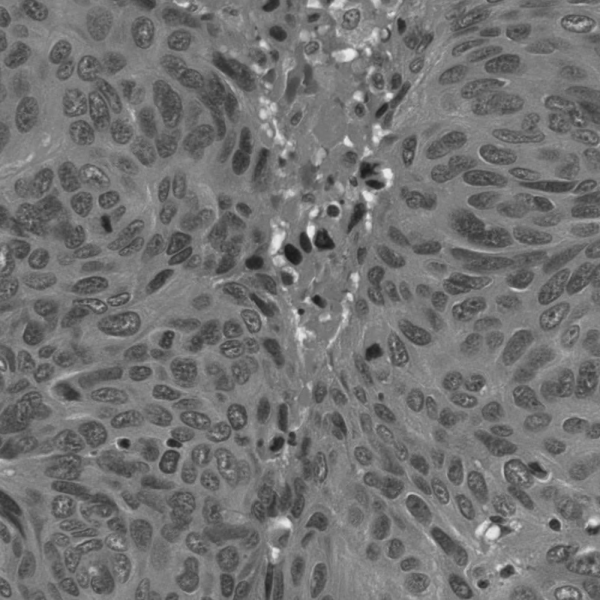
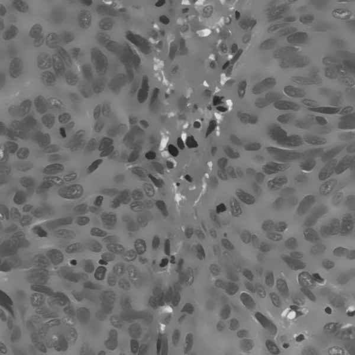
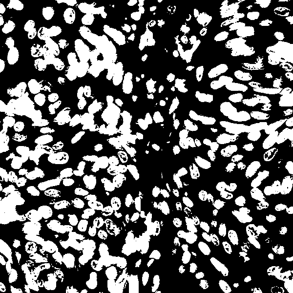
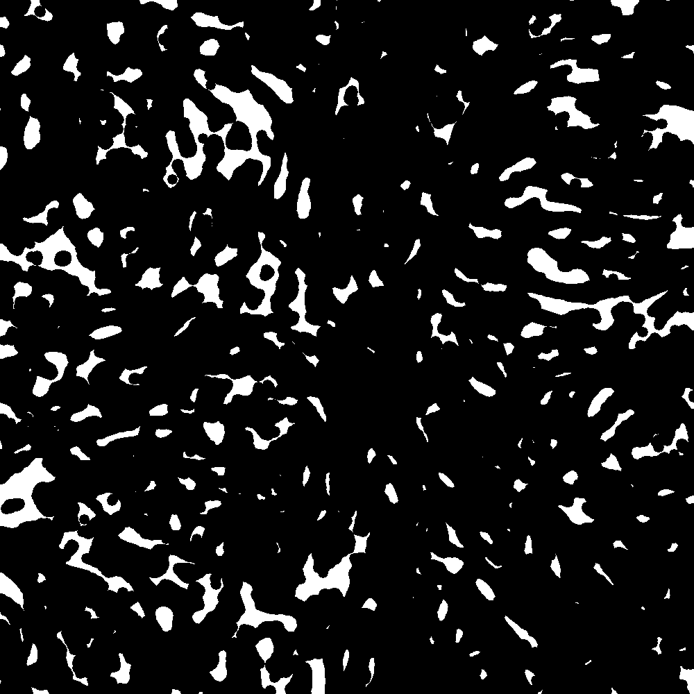
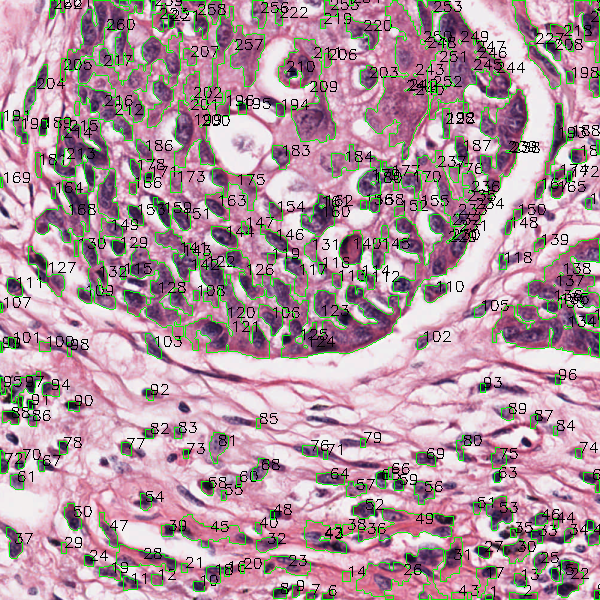
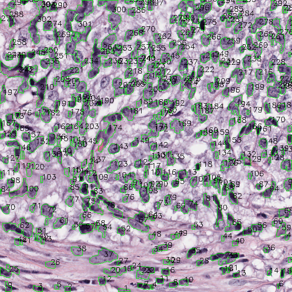
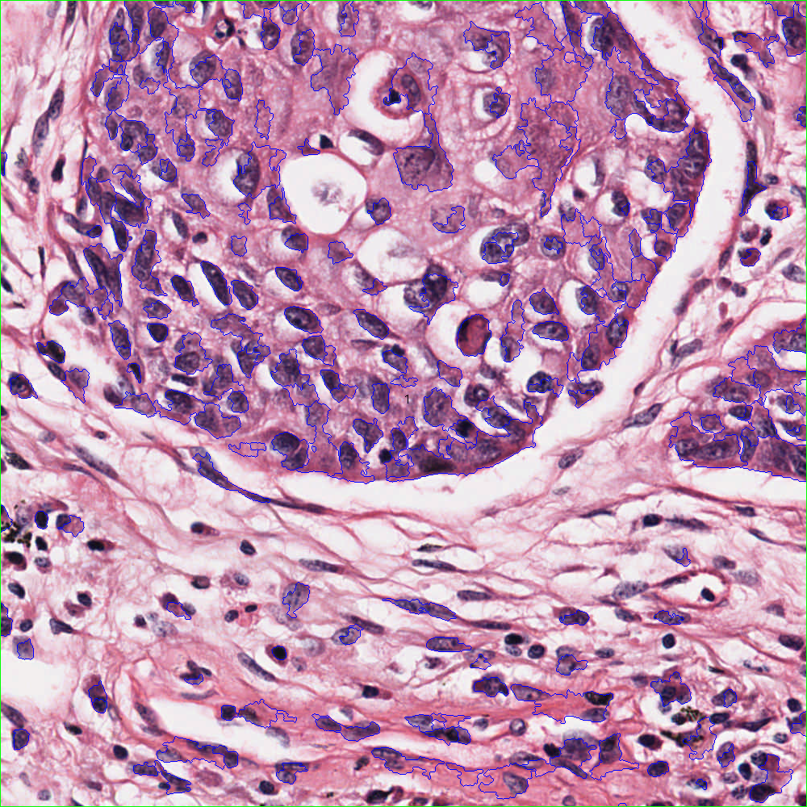
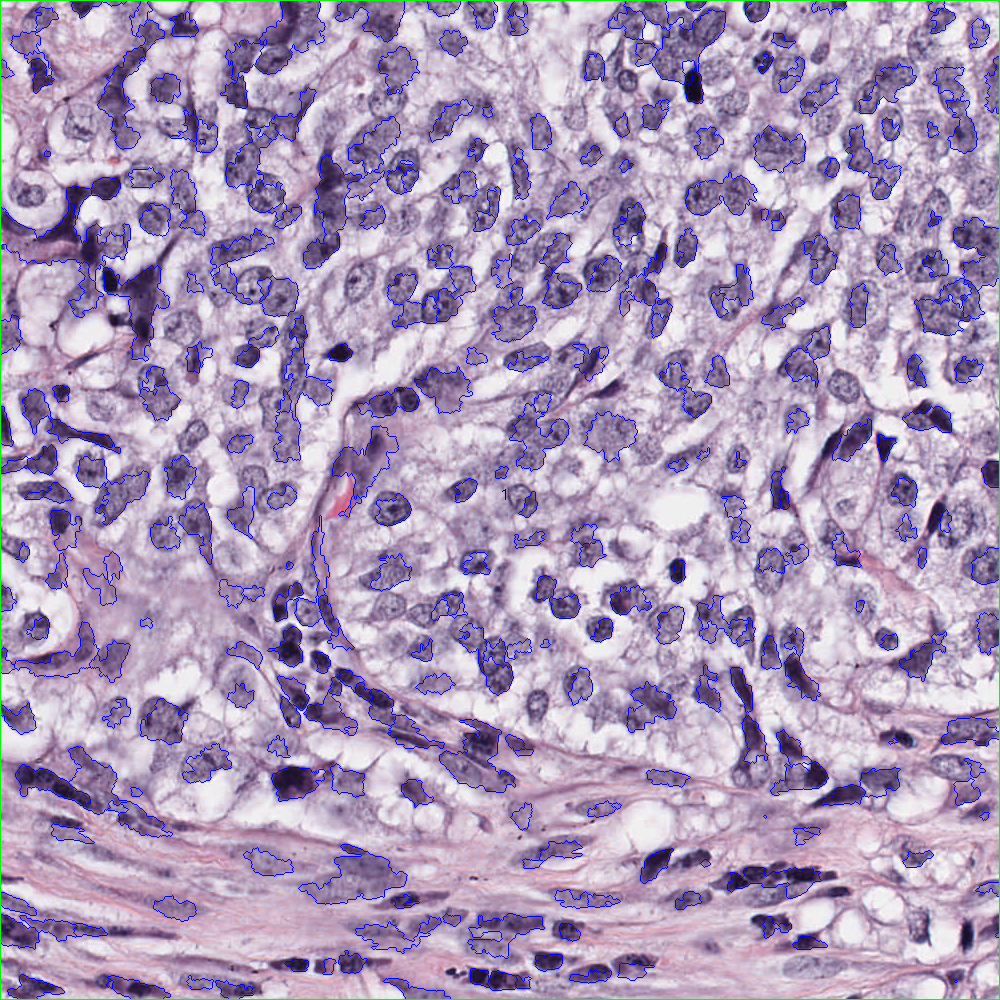

# Image Processing 1
## Methods used
1. Bilateral filter
2. Otsu threhold
3. Morphological operations: Open, Ellipse, Erode, Dilation.
4. Canny filter
5. Distance transform and Watershed method

## Algorithm implementation

### Pre-processing

First, we load the image, reducing the size at 60% and get the gray scale form.
```python
img1 = cv2.imread("images\TCGA-18-5592-01Z-00-DX1.tif", cv2.IMREAD_COLOR)
original = img1.copy()
original = resize(original, 60)
# To gray scale
img2 = cv2.cvtColor(original, cv2.COLOR_BGR2GRAY)
cv2.imshow("original", img2)
```

### Noise Filter

Instead of using a Gaussian filter, we use a bilateral filter to better preserve cell edges. Particularly in these images it is necessary given the proximity of some cells to others.
```python
# Noise filter
filter = cv2.bilateralFilter(img1,20,20,20)
```


### Binarization
Aplication of the Otsu threshold:
It allows us to do an automatic binarization. This method is particularly useful to avoid having to manually set the threshold.
```python
ret, th = cv2.threshold(filter, 0, 255, cv2.THRESH_OTSU)
```


Invertion of the result
```python
th = abs(255 - th)
```

### Aplication of morphologic operations
```python
opening = cv2.morphologyEx(th, cv2.MORPH_OPEN, kernel, iterations = 2)
cv2.imshow("opening", opening)
sure_bg = cv2.dilate(opening, kernel, iterations=3)
```
```python
opening = cv2.morphologyEx(th, cv2.MORPH_OPEN, kernel, iterations = 1)
cv2.imshow("opening", opening)
#ELLIPSE
kernel = np.ones((10,5),np.uint8)
closing = cv2.morphologyEx(opening, cv2.MORPH_ELLIPSE, kernel, iterations=1)
cv2.imshow("erosion", closing)
```

### Watershed Filtration
```python
dist_transform = cv2.distanceTransform(opening, cv2.DIST_L2, 5)
# Make the distance transform normal.
dist_output = cv2.normalize(dist_transform, None, 0, 1.0, cv2.NORM_MINMAX)
# Display the distance transform
cv2.imshow('Distance Transform', dist_output)

ret, sure_fg = cv2.threshold(dist_output, 0.25*dist_output.max(), 255, 0)
sure_fg = cv2.morphologyEx(sure_fg, cv2.MORPH_ERODE, kernel, iterations = 4)

# Finding unknown region
sure_fg = np.uint8(sure_fg)
unknown = cv2.subtract(sure_bg, sure_fg)
cv2.imshow('sure_fg', sure_fg)

# Marker labelling
ret, markers = cv2.connectedComponents(sure_fg)
# Add one to all labels so that sure background is not 0, but 1
markers = markers+1
# Now, mark the region of unknown with zero
markers[unknown==255] = 0

#cv2.imshow('makers', markers)
markers = cv2.watershed(img2, markers)
```

Finally, count the number of cells
```python
contours, hierarchy = cv2.findContours(closing, cv2.RETR_TREE, cv2.CHAIN_APPROX_SIMPLE)
cells = 0
for i in contours:
    M = cv2.moments(i)
    if M['m00'] != 0:
        cx = int(M['m10']/M['m00'])
        cy = int(M['m01']/M['m00'])
        cells += 1
        cv2.drawContours(original, [i], -1, (0, 255, 0), 1)
        cv2.putText(original, str(cells), (cx, cy), cv2.FONT_HERSHEY_SIMPLEX, 0.5, (0, 0, 0), 1)

cv2.imshow('img2', original)
cv2.imwrite('results/canny.tif', original)
```
#### Canny result
Image 1: 234 cells


Image 2: 262 cells


Image 3: 305 cells


#### Watershed result
Image 1:


Image 2:


Image 3:



## Conclusion
It was possible to eliminate image noise with the bilateral filter with a good result.

Humbralization with the otsu method is quick and effective, but not perfect. Some borders between cells are lost, making segmentation difficult with morphological operations.

Morphological operations have been useful to segment and separate one cell from others, however it is not perfect. Increasing the size of the filter can be effective in separating cells from an area, but some smaller cells are lost with the same operation.

In the last stage of the segmentation, edge detection with the canny method has performed better than the joint use of the distance transformation with the watershed method.

## References
* Reading an image: https://www.geeksforgeeks.org/opencv-python-tutorial/#images
* resize-image.py: https://www.tutorialkart.com/opencv/python/opencv-python-resize-image/
* Gaussian filter: https://www.geeksforgeeks.org/python-image-blurring-using-opencv/
* Thresholding: https://docs.opencv.org/4.x/d7/d4d/tutorial_py_thresholding.html
* Count cells: https://stackoverflow.com/questions/58751101/count-number-of-cells-in-the-image
* Watershed: https://docs.opencv.org/4.x/d3/db4/tutorial_py_watershed.html